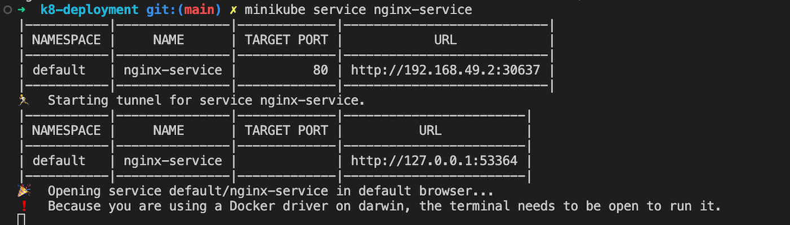

# NGINX Deployment on Kubernetes with NodePort Service using Minikube

This project demonstrates how to deploy an NGINX web server on a Kubernetes cluster using a **Deployment** and expose it using a **NodePort Service**.


## Quick Overview

This guide walks through the steps of deploying NGINX in Kubernetes and exposing it via a **NodePort** service using **Minikube**. By the end, you’ll have an externally accessible NGINX web server running in your Kubernetes cluster.

---

## Prerequisites

- **Minikube** installed on your machine.
- **kubectl** (Kubernetes CLI) installed.
- Basic understanding of Kubernetes concepts. If you're new to Kubernetes, check out the [Kubernetes Overview](ABOUT-KUBERNETES.md).

---

## NGINX Deployment and Service Configuration

The following YAML configuration defines an NGINX deployment and a NodePort service that makes it accessible externally.

### `nginx-deployment.yml` File

```yaml
---
apiVersion: apps/v1
kind: Deployment
metadata:
  name: nginx
spec:
  replicas: 2
  selector:
    matchLabels:
      app: nginx
  template:
    metadata:
      labels:
        app: nginx
    spec:
      containers:
      - name: nginx
        image: nginx:latest
        resources:
          limits:
            memory: "512Mi"
            cpu: "500m"
        ports:
        - containerPort: 80

---
apiVersion: v1
kind: Service
metadata:
  name: nginx-service
spec:
  type: NodePort
  selector:
    app: nginx
  ports:
  - port: 80
    targetPort: 80

```
---

## Commands to Deploy and Expose NGINX on Kubernetes using Minikube

To deploy and expose NGINX using a **NodePort Service** with **Minikube**, I ran the following commands:


1. **Create the NGINX Deployment and Service**:
   `kubectl apply -f nginx-deployment.yml`


2. **Verify Deployment and Service**
` kubectl get deployments`
`kubectl get services`

3. **Access the NGINX Web Server** using Minikube:

Get the URL of the service exposed by Minikube:

`minikube service nginx-service`

This will output the URL where the NGINX service is available: 



---

## Additional Resources

- [Kubernetes Official Documentation](https://kubernetes.io/docs/)
- [Minikube Documentation](https://minikube.sigs.k8s.io/docs/)
- [NGINX Documentation](https://nginx.org/en/docs/)


